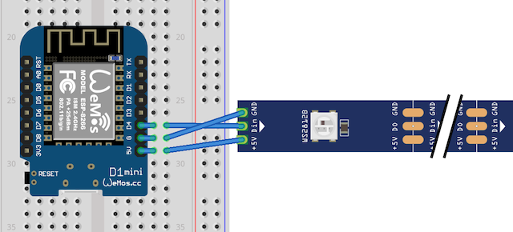
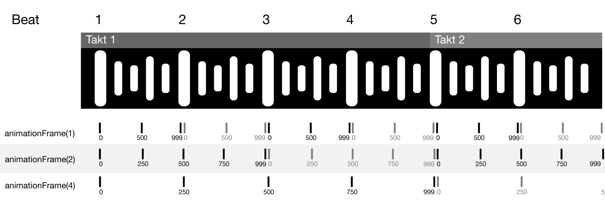

# ProjektionFX

ProjektionFX lässt deine WS2812-LED-Stripes zu Hause im Takt von den DJ Streams von unserem Ilja von [ProjektionTV](https://www.projektion.tv/) aufleuchten!

Besuche uns gerne:

- 📺 Live auf [twitch.tv/projektiontv](https://www.twitch.tv/projektiontv/)  
  Streams immer _Montag, Mittwoch und Freitag_ von 16:00 Uhr bis ca. 20/21 Uhr
- 🤷‍♂️ auf unserem [Discord](https://discord.gg/92JNBJR) - dort tummeln sich viele nette und hilfsbereite ProjektionTV ZuschauerInnen herum. Die beste Anlaufstelle, wenn es Fragen gibt!
- 🌐 auf der [ProjektionTV Webseite](https://www.projektion.tv/)

# Inhaltsverzeichnis

- 🔌 [Benötigte Hardware](#benötigte-hardware)
- 🛠 [Installation](#installation)
- ⌨️ [mit Entwickeln](#mit-entwickeln)

# Benötigte Hardware

- einen [ESP8266](https://amzn.to/38htUZG)\* oder [ESP32](https://amzn.to/38h9P5I)\* Mikrocontroller
- einen [WS2812-LED Stripe](https://amzn.to/2LL7WH3)\*
- ein paar Kabel, um den ESP und den LED Stripe miteinander zu verbinden
- _Optional:_ Wenn dein LED Stripe lang ist, dann solltest du Ihn über ein Netzteil extra mit Strom versorgen!

<sup>_mit Sternchen (\*) gekennzeichnete Links sind Affiliate-/Werbelinks. Wenn du mit diesen einkaufst, dann unterstützt du ProjektionTV! Vielen Dank!_</sup>

# Installation

## Methode 1: Web installer

(tbd)

## Methode 2: Image herunterladen

- Als erstes installiere [esptool.py](https://docs.espressif.com/projects/esptool/en/latest/esp32/) (Benötigt Python und [pip](https://pip.pypa.io/en/stable/installation/))
- Lade die aktuelle Binärdatei von der [Releases](https://github.com/ProjektionTV/ProjektionFX/releases) Seite herunter.  
   Download-Links für die neusten Versionen:
  - [ESP8266 - D1 Mini](https://github.com/ProjektionTV/ProjektionFX/releases/latest/download/ProjektionFX_d1_mini_ESP8266.bin)
  - [ESP8266 - NodeMCU](https://github.com/ProjektionTV/ProjektionFX/releases/latest/download/ProjektionFX_nodemcuv2_ESP8266.bin)
  - [ESP32 - ESP32Thing](https://github.com/ProjektionTV/ProjektionFX/releases/latest/download/ProjektionFX_esp32thing_ESP32.bin)
- Stelle sicher, dass nur _ein_ ESP mit deinem Computer verbunden ist, um nicht aus versehen den falschen ESP zu flashen! Du kannst auch direkt den Port angeben, z.B. `-port COM4` nach dem `write_flash` in den nachfolgenden Befehlen

**ESP8266**

```
esptool.py write_flash 0x0 ./ProjektionFX_XXX.bin
```

**ESP32**

Wenn der ESP32 noch keinen Bootloader hat, muss dieser erst geschrieben werden. Lade einen Bootloader, z.B. von dem [WLED Projekt](https://github.com/Aircoookie/WLED/releases/download/v0.13.1/esp32_bootloader_v4.bin) herunter.

```
esptool.py write_flash 0x0 ./esp32_bootloader_v4.bin
```

Anschließend schreibe das ProjektionFX Image. **Achtung:** Achte darauf, dass hier erst ab dem Offset `0x10000` geschrieben wird!

```
esptool.py write_flash 0x10000 ./ProjektionFX_XXX.bin
```

_Bei manchen ESPs muss der **BOOT** Knopf gedrückt werden, damit ein neues Image geflasht werden kann._

# Einrichtung

Wenn du ProjektionFX erfolgreich aufgespielt hast, dann öffnet dieser (wenn er an den Strom angeschlossen ist) ein WLAN, über dass du ProjektionFX konfigurieren kannst.

1. Verbinde dich mit dem WLAN **ProjektionFX**, am besten von deinem Handy oder Tablet aus
2. Es öffnet sich eine Seite, um die Konfiguration auszuführen.  
   Wenn nicht: öffne in deinem Browser die Adresse [http://192.186.4.1](http://192.186.4.1)
3. Klicke auf **Configure WiFi**:
   1. Wähle **dein WLAN** aus
   2. Trage dein **Passwort** ein
   3. Trage die Daten für den ProjektionTV **MQTT Server** ein.  
      Die _Server-Adresse_ sowie Benutzername und Passwort erhälst du entweder im Chat oder du besuchst unseren [Discord-Server](https://discord.gg/92JNBJR)!
4. Tippe auf **Save** um die Einstellungen zu speichern. Der ESP startet nun neu und verbindet sich mit deinem WLAN und empfängt automatisch den Beat von ProjektionTV!

## Anschließen

In dem fertigen Image ist der Standard PIN für den LED Stripe für einen ESP8266 auf `D4` gesetzt (für den ESP32 auf `GPIO4`). Das Anschließen ist einfach:

- Der 5V PIN mit 5V vom LED Stripe verbinden
- GND vom ESP mit GND vom Stripe verbinden
- DIN oder DI (Data In) mit dem LED_PIN `D4` verbinden (_Wichtig_ die LED Stripes haben eine Richtung! DI/DIN = Eingabg, DO oder DOUT = Ausgang)



Die fertigen Images von ProjektionFX gehen von einem LED Strip mit 60 LEDs aus. Dies kann momentan leider noch nicht angepasst werden.

**Spannungsversorgung**

Wenn du einen LED Stripe mit vielen LEDs verwendest, dann solltest du die Stromversorgung **nicht** über die USB Versorgung bzw. über den ESP direkt verwenden! Wenn du ein extra Netzteil zur Spannungsversorgung nutzt, ist es wichtig, dass du GND vom Netzteil mit dem GND vom ESP (und damit mit dem USB) verbindest!

ProjektionFX nutzt die Strombegrenzung von FastLED. Diese wird über `LED_MAX_MILLIAMP` gesetzt (Standard: 500 Milliampere). Wenn du eine externe Stromversorgung angeschlossen hast, kannst du dies natürlich entsprechend erhöhen.  
Wenn du den ESP und den LED Strip über USB versorgst, dann vielleicht auch - aber pass auf, dass er nicht zuviel Strom zieht. Wir wollen ja, dass es nur im DJ-Stream heiß her geht und nicht dein Zuhause auch in Flammen aufgeht ;-)

# Selber kompilieren

Das Projekt nutzt [PlatformIO](https://platformio.org/), um das Programm für den Arduino/ESP zu erstellen.

Um die Einstellungen anzupassen, erstelle dir im `src` Ordner eine Datei `settings_custom.h`. Dort kannst du deine eigenen Einstellungen angeben:

```cpp
// Optional zum Vorausfüllen
#define MQTT_HOST "mqtt.example.org" // diese Daten bekommst du
#define MQTT_USER "user"             // auf dem ProjektionTV
#define MQTT_PASSWORD "password"     // Discord Server!


// LED Konfiguration
#define LED_PIN D4              // der PIN an dem dein LED Stripe angeschlossen ist
#define NUM_LEDS  128           // die Anzahl von LEDs
#define LED_MAX_MILLIAMP 500    // maximale Milliampere


// Sonstiges
#define DEBUG_SERIAL true
```

Die `settings_custom.h` zu nutzen (statt direkt in der `settings.h` zu bearbeiten) hat den Vorteil, dass diese von git ignoriert wird, so dass es beim aktualisieren über git nicht zu konflikten kommt.

In der `plattformio.ini` Datei findest du verschiedene, vordefinierte Profile für ESP8266 und ESP32 Boards. Wähle die für dich passende Environment in VSCode aus. Mit der Platformio-CLI gibst du das Profil z.B. über `pio run -e d1_mini` an.

# Mit-Entwickeln

ProjektionFX ist ein Community Projekt - und wir hoffen, dass viele Menschen Lust und Spaß daran haben, uns bei der Entwicklung zu helfen!

Wenn du eine Idee hast und mit-coden möchtest, dann melde dich am besten gerne im [Discord](https://discord.gg/92JNBJR) oder schreibe ein [Ticket](https://github.com/ProjektionTV/ProjektionFX/issues) im GitHub Repository und beschreibe kurz, was du vor hast.

## Effekte Entwickeln

ProjektionFX wird spannend, wenn möglichst viele Effekte - also Abläufe, wie die LEDs abhängig vom Beat der Musik leuchten - entstehen.

Wenn du Lust hast deinen eigenen Effekt zu entwickeln, schau dir mal die bestehenden Effekte, z.B. den `effect_movingdot_simple.h` an.

```cpp
class EffectMovingDotSimple : public Effect
{
public:
    static void run(BeatInfo beatInfo, CRGBSet leds, int numLeds)
    {
        // alle LEDs werden etwas "ausgeschaltet", also dunkler
        leds.fadeToBlackBy(100);

        // ein rotes Licht, dass auf jeden Beat einmal komplett über alle LEDs läuft
        // als erstes wird die Position bestimmt:
        // - die Zeit wo wir uns befinden, wird über die Methode beatInfo.animationFrame(1) abgefragt und
        //   gibt einen Wert von 0 (= bedeutet, wir sind ganz am Anfang, also der Beat kam gerade) bis 999
        //   (das heißt wir sind ganz am Ende, der nächste Beat kommt gleich!) zurück
        // - die map()-Methode 'mappt' (Dreisatz!) die Werte von animationFrame (0-999) auf den Bereich von
        //   0 bis zu unserer letzten LED (=numLeds-1)
        // - das Ergebnis wird in der Variable redLEDPosition gespeichert
        int redLEDPosition = map(beatInfo.animationFrame(1), 0, 999, 0, numLeds-1);

        // nun schalten wir die LED an der Position redLEDPosition auf rot
        leds[redLEDPosition] = CRGB::Red;

        // ein grünes Licht, dass in der Zeit von zwei Beat einmal komplett über alle LEDs läuft:
        // genauso, wie bei der roten, außer das wir hier beatInfo.animationFrame(2) aufrufen,
        // d.h.:
        // - bei dem Rückgabewert 0 sind wir auf dem 1. Beat,
        // - bei dem Rückgabewert 500 sind wir auf dem 2. Beat
        // - bei dem Wert 999 sind wir wieder ganz kurz vor dem 1. Beat
        // Insgesamt braucht die grüne LED immer 2 Beats (bei 120BPM wäre das 1 Sekunde), um über den
        // gesamten LED Streifen zu laufen.
        int greenLEDPosition = map(beatInfo.animationFrame(2), 0, 999, 0, numLeds-1);
        leds[greenLEDPosition] = CRGB::Green;


        // zum Abschluss noch ein bisschen Weichzeichnen; ist nicht notwendig, aber etwas 'schöner' und weicher,
        // wenn der Stripe lang ist. Denn auf jeden Beat über viele LEDs laufen ist schon ganz schön schnell ;)
        blur1d(leds, numLeds, 64);
    }
};
```

### Funktionsweise von `beatInfo.animationFrame(n)`

Um die Programmierung von Effekten zu vereinfachen - und nicht selbst mit BPM, Zeiten, Beginn des Liedes usw. rechnen zu müssen - gibt die Methode `beatInfo.animationFrame(n)` eine "Standardisierte" Information über den Beat zurück.

Die Methode gibt einen Integer-Wert zurück, der jeweils von 0 bis 999 läuft. Über den Parameter der Methode lässt sich skalieren, über _wieviele Beats_ sich dieser Bereich von 0-999 erstrecken soll:



Das lässt sich am besten an einem Beispiel erklären: Nachfolgend schreiben wir einen Effekt, der bei jedem Beat die Farbe ändert. Das Farbwechsel-Schema wiederholt sich dann alle 4 Beats (also nach einem Takt).

```cpp
[...]
static void run(BeatInfo beatInfo, CRGBSet leds, int numLeds)
{
    // die gesamt "Länge" des Effekts soll sich über 4 Beats erstrecken:
    int fortschritt = beatInfo.animationFrame(4);

    if(fortschritt < 250) {
        // wenn der Fortschritt zwischen 0 und 249 ist
        // setze die Farbe auf Rot
        leds = CRGB::Red;
    } else if(fortschritt < 500){
        // wenn der Fortschritt zwischen 250 und 499 ist
        // setze die Farbe auf Grün
        leds = CRGB::Green;
    } else if(fortschritt < 750){
        // wenn der Fortschritt zwischen 500 und 749 ist
        // setze die Farbe auf Blau
        leds = CRGB::Blue;
    } else {
        // wenn der Fortschritt zwischen 750 und 999 ist
        // setze die Farbe auf Gelb
        leds = CRGB::Yellow;
    }
}
[...]
```
Wenn also nun ein Lied mit 60 BPM angespielt wird (d.h. 60 Beats pro Sekunde, also alle Sekunden ein Beat) dann ändert sich mit diesem Effekt jede Sekunde die Farbe:
- 1. Beat: Rot
- 2. Beat: Grün
- 3. Beat: Blau
- 4. Beat: Gelb
- 5. Beat: *wieder von vorne* Rot

Wenn man nun z.B. einen "Punkt" in einem Takt (=4 Beats) über den kompletten LED-Streifen wandern lassen möchte, so muss man den Rückgabewert auf die Anzahl der LEDs mappen. Dies geht am einfachsten mit der `map` Funktion der Arduino-Bibliotheken: `map(inputWert, inputVon, inputBis, outputVon, outputBis)`, also für das Beispiel:

```cpp
leds = CRGB::Black; // erst mal alle LEDs auf aus ("schwarz") stellen

// berechne die LED Position:
// mappe den wert von animationFrame(4) 
// mit den Werten von 0 bis 999
// auf die Werte 0 bis numLeds-1 (also die Anzahl der LEDs)
int ledPosition = map(animationFrame(4), 0, 999, 0, numLeds-1); 
led[ledPosition] = CRGB::Red;
```

**Hinweise zu animationFrame**
- es ist nicht garantiert, dass in jedem "Loop" ein bestimmter Wert zurückgegeben wird, da diese davon abhängen, wie schnell der ESP den gesamten Code ausführt. Daher solltest du nicht auf 'bestimmte' Werte reagieren:  
```cpp
//DON'T DO THIS:
if(animationFrame(1) == 0) {...} // dies wird NICHT immer ausgeführt!
```
- je schneller die BPM ist, desto schneller ändern sich die Werte von animationFrame. Wenn die Änderung dann schneller sind, als der ESP die Methode aufruft werden einzelne Werte übersprungen.  
In dem obrigen Beispiel, in dem der rote Punkt über den LED Stipe läuft, werden (sehr wahrscheinlich) bei einem `animationFrame(1)` Aufruf mit 300 LEDs einzelne LEDs übersprungen.
- ein ESP8266 schafft so ca. 100-120 FPS, ein ESP32 so ungefähr um die 200 FPS.

## Bitte beachten:

- ProjektionFX nutzt die großartige Bibliothek [FastLED](https://github.com/FastLED/FastLED); schau dort gerne in die Dokumentation, welche Funktionen / Hilfsfunktionen zur Verfügung stehen!
- ein Effekt darf/sollte **nicht** die Arduino oder FastLED `delay()` Methode nutzen und damit die Ausführung anhalten.
- die "Animation" der Effekte sollte irgendwie von dem Beat abhängig sein. Da die Lieder meist einen 4/4tel Takt haben, ist es meist am wirkungsvollsten, wenn du auf ein 4-faches von dem Beat 'animierst', also indem du der `beatInfo.animationFrame()`-Methode 4, 8, 16, usw. als Parameter übergibst

## ProjektionFX Kern

Momentan ist ProjektionFX ein kleines Grundgerüst, das noch deutlich weiterentwickelt werden muss.
Aktuell werden nur die BPM, also die Beats pro Minute, abgefragt und ausgewertet. Aber das soll nicht so bleiben!

- Synchronisierung mit _deinem_ Videobild - so dass deine LEDs nicht nur im richtigen Takt, sondern auch zum richtigen Zeitpunkt auf die Musik reagieren. Dies z.B. über
  - eine Photo-Diode und ein optisches Signal im ProjektionTV Videobild
- Synchronisierung, welcher Effekt gerade abgespielt wird
- und vieles mehr :)

# Sonstiges

Hier findest du ein [Impressum](https://www.projektion.tv/impressum/).
